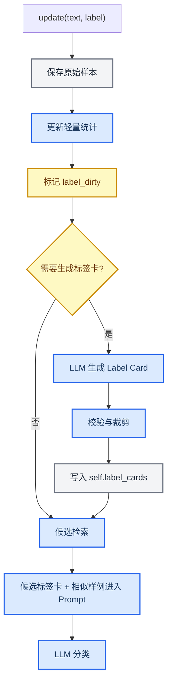

# 模块 08：记忆增强操作文档

_面向 `MyHarness` 的 LLM 辅助记忆增强流程，目标是在不训练模型权重、不读写磁盘文件的前提下提升有限上下文分类准确率。_

---

## 合规边界

根据原始 PDF 考核说明，`update(text, label)` 的职责是“接收一条带标签的训练样本，更新内部记忆”；基类注入了 `self.call_llm`、`self.count_messages_tokens`、`self.max_prompt_tokens` 和 `self.memory`。PDF 同时明确要求：只提交 `solution.py`、禁止读写任何文件、禁止获取测试集标签、单次 `call_llm` 的 prompt token 上限为 `2048`。

因此记忆增强可以做，但必须满足：

| 操作 | 是否允许 | 说明 |
| --- | --- | --- |
| 用 `update` 保存原始训练样本 | 允许 | 这是题目要求的内部记忆更新 |
| 用 `self.call_llm` 总结标签含义 | 允许但需节制 | PDF 未限制 `call_llm` 只能在 `predict` 使用 |
| 将摘要写入 `self.label_cards` | 允许 | 这是 Harness 内部状态 |
| 写入 `.md`、`.json`、`.txt` 等磁盘文件 | 禁止 | PDF 明确禁止读写任何文件 |
| 直接 import `openai` 调 API | 禁止 | 只允许标准库、`numpy`、`harness_base` |
| 使用测试集标签改写记忆 | 禁止 | 一经发现得分归零 |

一句话原则：**记忆增强是“模型权重外部、Harness 内部”的状态增强，不是外部文件持久化。**

## 目标

记忆增强的目标不是把训练集重写成一大段摘要，而是为每个标签生成短而稳的 **Label Card**，让后续 Prompt 在 `2048` token 内获得更高密度的标签语义。

| 原始记忆 | 增强记忆 |
| --- | --- |
| 训练样本文本和标签 | 标签含义、关键词、正例模式、反例边界、代表样例 |
| 高可靠、但 token 成本高 | 更省 token、但可能有 LLM 总结误差 |
| 适合检索 | 适合放入 Prompt |

## Label Card 结构

推荐每个标签维护一张短卡片：

```python
self.label_cards[label] = {
    "description": "一句话说明该标签表示什么",
    "keywords": ["关键词1", "关键词2", "关键词3"],
    "positive_patterns": ["什么情况应该选它"],
    "negative_boundaries": ["什么情况不应该选它"],
    "canonical_examples": ["最典型的1-2条原始样例"]
}
```

字段长度应严格控制：

| 字段 | 建议长度 | 作用 |
| --- | ---: | --- |
| `description` | 20-50 字 | 给 LLM 标签语义 |
| `keywords` | 3-8 个 | 给检索和 Prompt 提供弱信号 |
| `positive_patterns` | 1-3 条 | 总结什么情况选该标签 |
| `negative_boundaries` | 0-2 条 | 区分混淆标签 |
| `canonical_examples` | 1-2 条 | 保留事实依据 |

## 操作流程



### 第一步：`update` 只做可靠写入

`update` 阶段优先保存事实记忆，不建议每条样本都立刻调用 LLM。

```python
def update(self, text: str, label: str) -> None:
    super().update(text, label)
    if label not in self.label_set:
        self.label_set.add(label)
        self.labels.append(label)
        self.by_label[label] = []
        self.label_dirty.add(label)

    self.by_label[label].append(text)
    self._update_label_profile(label, text)
    self.label_dirty.add(label)
```

### 第二步：触发标签卡生成

推荐 **懒加载**，即在 `predict` 中某个标签进入候选集、但还没有标签卡时再生成。这样可以避免对永远不会进入候选的标签浪费调用。

触发条件：

| 条件 | 是否触发 |
| --- | --- |
| 标签进入候选 top-k | 是 |
| 标签样例数大于等于 2 | 是 |
| 该标签已经有可用标签卡且未变脏 | 否 |
| 当前样本量很大且评测时间紧 | 可跳过 LLM，使用规则版标签卡 |

```python
def _ensure_label_cards(self, candidate_labels):
    for label in candidate_labels:
        if label in self.label_cards and label not in self.label_dirty:
            continue
        if len(self.by_label.get(label, [])) >= 2:
            self.label_cards[label] = self._build_label_card_with_llm(label)
            self.label_dirty.discard(label)
```

### 第三步：LLM 生成标签卡

标签卡生成 Prompt 必须短，且明确禁止扩写无依据内容。

```text
你是分类标签摘要器。根据给定训练样本，总结标签含义。
只输出 JSON，不要解释。不要编造训练样本之外的规则。

标签：{label}
训练样本：
1. {example_1}
2. {example_2}
3. {example_3}

输出 JSON：
{
  "description": "一句话说明标签含义，少于50字",
  "keywords": ["3到8个关键词"],
  "positive_patterns": ["1到3条应该选择该标签的情况"],
  "negative_boundaries": ["0到2条不应选择该标签的边界"],
  "canonical_examples": ["1到2条最典型原始样例"]
}
```

### 第四步：校验与裁剪

LLM 输出不能直接信任。必须校验字段、限制长度，并在解析失败时回退到规则版标签卡。

```python
def _sanitize_label_card(self, card, label):
    return {
        "description": shorten(str(card.get("description", "")), 80),
        "keywords": take_short_strings(card.get("keywords", []), limit=8, max_len=16),
        "positive_patterns": take_short_strings(card.get("positive_patterns", []), limit=3, max_len=40),
        "negative_boundaries": take_short_strings(card.get("negative_boundaries", []), limit=2, max_len=50),
        "canonical_examples": self._select_canonical_examples(label, limit=2),
    }
```

规则版回退：

```python
def _build_rule_label_card(self, label):
    examples = self.by_label.get(label, [])
    return {
        "description": f"训练集中标签为 {label} 的文本类别。",
        "keywords": self._top_profile_terms(label, limit=6),
        "positive_patterns": [],
        "negative_boundaries": [],
        "canonical_examples": examples[:2],
    }
```

### 第五步：预测时使用标签卡

不要把所有标签卡放进 Prompt。只放候选标签的标签卡，并配合相似原始样例。

```text
候选标签资料：

[催发货]
含义：用户询问订单何时发出、物流进度或希望尽快发货。
关键词：发货、物流、催、还没发
边界：明确要求退款/退货时不要选该标签。
示例：我的订单怎么还没发？

[退货退款]
含义：用户要求退货、退款、取消订单或咨询退款进度。
关键词：退款、退货、取消、退钱
示例：我买错了想退货。
```

## 三种实现档位

### 档位 A：规则增强

不调用 LLM，只用统计和代表样例生成标签卡。

| 优点 | 缺点 |
| --- | --- |
| 快、稳定、完全可控 | 标签含义表达较弱 |

适合第一版 baseline。

### 档位 B：懒加载 LLM 标签卡

候选标签首次进入预测时，调用 LLM 生成标签卡并存入 `self.label_cards`。

| 优点 | 缺点 |
| --- | --- |
| token 密度高，可能提升准确率 | 有调用成本和总结误差 |

适合第二版 ablation。

### 档位 C：混淆对增强

只对经常混淆或检索分数接近的标签对生成边界规则。

```text
请比较标签 A 和标签 B 的训练样本，生成一条不超过50字的区分规则。
不要编造未被样本支持的业务规则。
```

| 优点 | 缺点 |
| --- | --- |
| 对混淆类提升明显 | 需要本地验证或稳定触发条件 |

适合后期优化。

## 风险控制

| 风险 | 表现 | 控制方法 |
| --- | --- | --- |
| 过拟合 | 标签卡只贴合 DEV 客服表达 | 标签卡写成通用语义，不写死业务规则 |
| 记忆污染 | LLM 总结错后反复影响预测 | 原始样例永远保留，标签卡只作软提示 |
| 超时 | `update` 或 `predict` 调用过多 LLM | 懒加载、缓存、限制每轮生成数量 |
| 超预算 | 标签卡太长挤掉原始输入 | 字段限长，Prompt 只放候选标签卡 |
| 幻觉规则 | LLM 生成训练样本没有支持的边界 | Prompt 明确禁止编造，解析后裁剪 |

## Ablation 建议

至少比较三版：

| 版本 | 内容 | 判断 |
| --- | --- | --- |
| `A` | 只用原始样例检索 | 基线 |
| `B` | 原始样例 + 规则版标签卡 | 看确定性增强是否有效 |
| `C` | 原始样例 + LLM 标签卡 | 看 LLM 摘要是否有效 |
| `D` | 原始样例 + LLM 标签卡 + 混淆边界 | 看边界规则是否提升 |

如果 `C` 比 `A` 高，说明记忆增强有效；如果 `C` 低于 `A`，说明标签卡污染或过拟合，应缩短标签卡、减少边界规则，或只对高置信候选使用。

## 网上资料如何参考

| 资料 | 可借鉴点 | 不要照搬 |
| --- | --- | --- |
| MemGPT / Letta | 分层记忆：上下文内 core memory + 上下文外 archival memory；记忆不是全量塞 Prompt，而是按需加载 | 不要使用 Letta 框架或持久化数据库，提交环境只允许 `solution.py` |
| Letta memory blocks | 把重要记忆整理成结构化 block，并作为 Prompt 的固定片段 | 本项目不能创建外部 memory block 文件，只能用 `self.label_cards` 模拟 |
| Dynamic Cheatsheet | 测试时维护短 cheatsheet，用 adaptive memory 改善黑盒 LLM 表现 | 不要在没有反馈时无限扩写 cheatsheet |
| ACE | 把上下文视作可演化 playbook，通过生成、反思、整理积累经验 | 本项目时间和依赖有限，只做轻量标签卡与混淆规则 |
| Meta-Harness | Harness 的核心是决定存什么、检索什么、呈现什么；文本分类中 token 成本也重要 | 不需要实现自动搜索 harness 代码 |
| Many-label ICL | 标签多时使用检索给 LLM 局部标签空间 | 不要只靠检索硬判，最终仍让 LLM 做候选内语义判断 |
| LLMLingua / LongLLMLingua | 分区预算和压缩思想：保留关键信息，压缩低价值上下文 | 不要引入第三方压缩模型；只借鉴预算分配和字段裁剪 |
| ReadAgent | 将长输入压缩为 gist memory，需要时回看原文 | 本项目可把标签样例压缩为 Label Card，同时保留原始样例 |

## 推荐落地方案

最稳的提交实现路线：

1. `update` 保存原始样本、标签集合、按标签分组、轻量词面统计
2. `predict` 先检索候选标签和相似样例
3. 对候选标签懒加载生成 `label_cards`
4. 生成失败时使用规则版标签卡
5. Prompt 中只放候选标签卡和少量相似原始样例
6. 每次 `call_llm` 前用 `count_messages_tokens` 控制预算
7. 最终输出解析回训练集中出现过的合法标签

这样做的定位是：**原始样例负责事实可靠性，Label Card 负责语义压缩，LLM 分类器负责最终判别。**

## 参考链接

| 方向 | 资料 | 链接 |
| --- | --- | --- |
| Harness 优化 | Meta-Harness: End-to-End Optimization of Model Harnesses | https://arxiv.org/abs/2603.28052 |
| 分层记忆 | Letta Agent memory & architecture | https://docs.letta.com/guides/agents/architectures/memgpt |
| 结构化记忆块 | Letta Memory blocks | https://docs.letta.com/guides/agents/memory-blocks/ |
| 自适应记忆 | Dynamic Cheatsheet GitHub | https://github.com/suzgunmirac/dynamic-cheatsheet |
| 上下文演化 | ACE GitHub | https://github.com/ace-agent/ace |
| 大标签分类 | In-Context Learning for Text Classification with Many Labels | https://arxiv.org/abs/2309.10954 |
| Prompt 压缩 | LLMLingua GitHub | https://github.com/microsoft/LLMLingua |
| 长文 gist memory | ReadAgent | https://arxiv.org/abs/2402.09727 |

