# Harness 模块文档索引

_有限上下文文本分类 Harness 的模块化设计文档，日期：2026-05-07_

---

## 模块划分

本文档目录将 `MyHarness` 拆成可实现、可验证、可写入报告的 7 个核心模块。每个模块文档都包含功能、技术方案、实现接口、预算影响、风险和参考内容。

| 模块 | 文档 | 主要目标 |
| --- | --- | --- |
| 外部记忆管理 | [01_external_memory.md](./01_external_memory.md) | 在 `update` 阶段保存标签、样例、原型和混淆经验 |
| 候选检索与压缩 | [02_candidate_retrieval.md](./02_candidate_retrieval.md) | 从全量标签和样例中筛出少量高价值上下文 |
| Token 预算控制 | [03_budget_controller.md](./03_budget_controller.md) | 保证单次 Prompt 不超过 `2048` token |
| Prompt 组装 | [04_prompt_composer.md](./04_prompt_composer.md) | 将候选标签、示例、规则和输入组织为稳定 Prompt |
| LLM 分类推理 | [05_llm_classifier.md](./05_llm_classifier.md) | 在候选标签内完成单轮或少量多轮分类 |
| 输出解析与验证 | [06_output_parser_verifier.md](./06_output_parser_verifier.md) | 将 LLM 输出映射为合法 exact-match 标签 |
| 反馈记忆与评测 | [07_feedback_and_evaluation.md](./07_feedback_and_evaluation.md) | 记录错误、混淆、指标和 ablation 路线 |
| 记忆增强操作 | [08_memory_enhancement_operations.md](./08_memory_enhancement_operations.md) | 用 LLM 或规则生成 Label Card，增强外部记忆 |

## 总体数据流

```mermaid
flowchart LR
    accTitle: Harness Module Flow
    accDescr: This diagram shows how training examples and prediction inputs pass through memory, retrieval, budgeting, prompting, classification, parsing, verification, and evaluation modules.

    update_call["update(text, label)"] --> memory["External memory"]
    memory --> retrieval["Candidate retrieval"]
    predict_call["predict(text)"] --> retrieval
    retrieval --> budget["Token budget controller"]
    budget --> prompt["Prompt composer"]
    prompt --> llm["LLM classifier"]
    llm --> parser["Output parser"]
    parser --> verifier["Verifier or fallback"]
    verifier --> label["Final label"]
    parser --> feedback["Feedback and evaluation"]
    feedback --> memory

    classDef process fill:#dbeafe,stroke:#2563eb,stroke-width:2px,color:#1e3a5f
    classDef storage fill:#f3f4f6,stroke:#6b7280,stroke-width:2px,color:#1f2937
    classDef success fill:#dcfce7,stroke:#16a34a,stroke-width:2px,color:#14532d

    class retrieval,budget,prompt,llm,parser,verifier,feedback process
    class memory storage
    class label success
```

## 实现优先级

| 优先级 | 模块 | 原因 |
| --- | --- | --- |
| P0 | 外部记忆管理、候选检索、预算控制、输出解析 | 决定能否稳定运行并返回合法标签 |
| P1 | Prompt 组装、LLM 分类推理 | 决定主要准确率 |
| P2 | 反馈记忆、二次验证、完整评测 | 用于进一步提升准确率和报告质量 |

## 约束提醒

- 最终提交应只依赖 `solution.py` 内的 `MyHarness` 实现。
- 不读写磁盘，不访问测试标签，不硬编码 DEV 测试集答案。
- 每次 `call_llm` 前必须用 `self.count_messages_tokens(messages)` 检查预算。
- `predict` 返回值必须是训练集中出现过的标签字符串。
