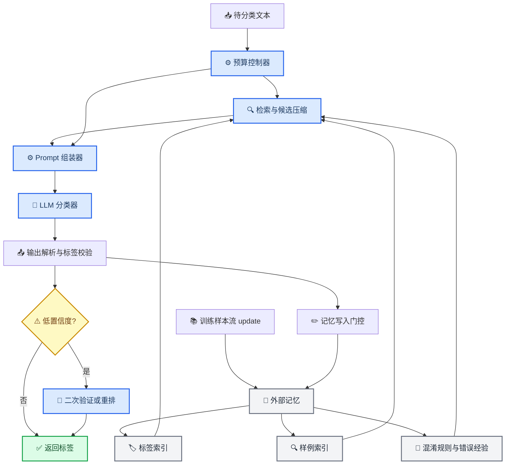

# 有限上下文文本分类 Harness 参考文档

_面向 `student_package` 项目的外部记忆管理、预算控制与推理 Harness 资料整理，日期：2026-05-07_

---

## 📋 结论摘要

本项目的关键不是“写一个更长的 Prompt”，而是设计一个能在 `2048` token 输入窗口内稳定工作的 **Harness**：它决定训练样本如何存储、如何检索、如何压缩、如何进入 Prompt，以及何时调用 LLM、何时使用确定性兜底。Meta-Harness 将 harness 定义为“决定存储、检索和呈现给模型的信息的代码”，并在在线文本分类中报告了比上下文管理基线更高的准确率和更低的上下文 token 成本，因此它是本题最贴近的总参考。[^1]

推荐主线是：用 `update(text, label)` 构建外部记忆；用 `predict(text)` 先做候选标签和相似样例检索；再由预算控制器在 `2048` token 内组装短 Prompt；最后用 LLM 做候选集内判别，并用输出解析、标签校验、低置信度二次验证提升稳定性。这个思路分别受到 many-label ICL、Dynamic Cheatsheet、ACE、LLMLingua 和 token-budget-aware reasoning 的支持。[^2][^3][^4][^5][^6]

---

## 🧭 问题定位

本任务可以归类为 **LLM system / harness engineering for low-context classification**。和普通文本分类相比，它有三个额外约束：

| 约束 | 对 Harness 的含义 |
| --- | --- |
| 单轮输入 token 小于 `2048` | 必须精确预算，不允许全量训练样本或长标签说明无脑进入 Prompt |
| 不训练模型权重 | 性能主要来自外部记忆、检索、Prompt 组织、输出解析和评测反馈 |
| 正式评测包含 OOD 分类和选择题 | 不能硬编码客服领域规则，应实现领域无关的样例检索、标签候选和兜底 |

这使得方案重点从“选择哪个 LLM”转向“如何把有限上下文变成高价值上下文”。ACE 把这类方法称作 context adaptation：通过修改输入中的指令、策略和证据来提升任务表现，而不是更新模型权重。[^3]

---

## 🏗️ 推荐 Harness 架构



### 设计分层

| 模块 | 作用 | 本项目建议 |
| --- | --- | --- |
| 外部记忆 | 保存训练样本、标签、标签原型、混淆规则 | 用 Python 内存结构即可，避免文件读写 |
| 候选检索 | 从全量标签/样例中筛出少量高价值上下文 | 标准库可做字符 n-gram、词重叠、编辑相似度；若允许 `numpy` 可做轻量向量统计 |
| 预算控制 | 确保 Prompt 小于 `self.max_prompt_tokens` | 每次调用前用 `count_messages_tokens` 校验，超预算按优先级裁剪 |
| Prompt 组装 | 把候选标签、示例、规则、文本排成稳定格式 | 固定 schema，少解释，多结构 |
| 输出解析 | 保证 exact match | 只接受训练中出现的标签；否则做候选内最近匹配或重问 |
| 反馈写入 | 根据错误/低置信度更新经验 | 本地没有测试标签时可只记录低置信度和 LLM 混淆信息；有验证时可写 hard cases |

---

## 📚 关键论文与代码

### Harness 与上下文工程

| 资料 | 类型 | 核心观点 | 对本项目的启发 |
| --- | --- | --- | --- |
| Meta-Harness | 论文 + GitHub | 自动搜索 harness 代码；在线文本分类中提升准确率并降低上下文 token | 把 `solution.py` 看作可优化系统，而不是单个 Prompt |
| ACE | 论文 + GitHub | 上下文可演化为 playbook，通过生成、反思、整理积累策略 | 把错误经验和标签边界整理成短规则 |
| Dynamic Cheatsheet | 论文 + GitHub | 测试时维护自适应 cheatsheet，让黑盒 LLM 通过记忆积累提升 | 用 `cheatsheet` 记录高频混淆标签和判别口诀 |
| MemGPT / Letta | 论文 + 开源框架 | 将 LLM 上下文窗口类比为主存，将外部存储作为可分页记忆 | 设计内存层级：当前 Prompt、短期候选、长期样例库 |

Meta-Harness 是最值得重点引用的资料。它把性能问题归因到 harness 层，并明确关注“存什么、检索什么、呈现什么”。这与 `MyHarness.update` 和 `MyHarness.predict` 的接口天然对应。[^1][^7]

ACE 与 Dynamic Cheatsheet 更适合支撑“外部记忆不是简单存全量样本，而是保存可复用经验”的观点。ACE 强调结构化、增量更新可以避免 context collapse；Dynamic Cheatsheet 则展示了在测试时用 adaptive memory 改善黑盒 LLM 表现的路线。[^3][^4][^8]

### 文本分类与少样本检索

| 资料 | 类型 | 核心观点 | 对本项目的启发 |
| --- | --- | --- | --- |
| In-Context Learning for Text Classification with Many Labels | 论文 | 标签很多时，使用 dense retrieval 让模型只看到部分标签空间 | `predict` 先召回 top-k 候选标签，而不是塞入全部标签细节 |
| Retrieval-augmented Multi-label Text Classification | 论文 | 检索增强有利于多标签、长尾和低资源分类 | 训练样例应作为非参数记忆参与分类 |
| Active Example Selection for ICL | 论文 + GitHub | ICL 表现高度依赖示例选择，可以学习/优化示例选择策略 | few-shot 示例选择应重视相似度、多样性和混淆覆盖 |
| ReadAgent | 论文 + 项目页 | 将长文本压缩为 gist memory，并在需要时回看原文 | 若正式任务有长文本，可先提取短证据，再分类 |

many-label ICL 对本项目尤其重要：论文指出 ICL 在标签数量多时受上下文窗口限制，因此用检索模型只给 LLM 部分标签空间。DEV 集有 `77` 个标签，每类仅 `3` 个训练样本，正好是“标签多、样本少、窗口有限”的典型设置。[^2]

### 预算控制与 Prompt 压缩

| 资料 | 类型 | 核心观点 | 对本项目的启发 |
| --- | --- | --- | --- |
| LLMLingua | 论文 + GitHub | 使用预算控制和 token 级压缩，在高压缩率下保留语义 | 可借鉴“模块级预算 + 逐段压缩”，但本项目提交依赖受限，不宜直接引入 |
| TALE | 论文 + GitHub | 推理链存在冗余，可通过显式 token budget 压缩推理 | 分类 Prompt 应限制解释长度，只在必要时触发推理 |
| Budget Guidance | 论文 + GitHub | 用轻量预测器控制 thinking length，在紧预算下提升 token 效率 | 在本项目中可转化为“低置信度才二次调用”的动态预算策略 |
| `tiktoken` / tokenizer 计数 | 工具 | 调用前估算 token，避免越界 | 本项目已有 `count_tokens` 与 `count_messages_tokens`，应作为硬约束 |

LLMLingua 的直接代码可能不适合提交，因为项目只允许标准库、`numpy` 和本地基类；但它的思想很有用：不同 Prompt 区块重要性不同，应该优先保留任务指令、标签和当前输入，再压缩或裁剪示例。[^5]

TALE 与 Budget Guidance 面向 reasoning token，但分类任务也有类似问题：长解释通常浪费 token，并可能破坏 exact match。因此建议默认要求短 JSON 或纯标签输出，只在不确定时触发 verifier。[^6][^9]

### 评测框架

| 资料 | 类型 | 核心观点 | 对本项目的启发 |
| --- | --- | --- | --- |
| EleutherAI `lm-evaluation-harness` | GitHub | few-shot LLM 评测框架，强调任务配置和可复现 | 本地实验应固定 prompt、候选数、调用次数和 token 统计 |
| OpenAI Evals | GitHub | 用自定义 eval 监控 LLM 系统质量 | 可将 DEV 集划分为小验证集，记录策略版本的准确率 |
| Promptfoo | 工具文档 | 面向 Prompt 和 LLM 应用回归测试 | 适合后期做 Prompt ablation，但本项目无需引入依赖 |

---

## 🧠 可采纳的设计观点

### 记忆不是越多越好

2048 token 限制下，全量记忆会稀释关键信息。更高价值的记忆应分成：

| 记忆类型 | 内容 | 进入 Prompt 的条件 |
| --- | --- | --- |
| 标签集合 | 所有合法标签字符串 | 总是保留，必要时只保留候选标签 |
| 标签原型 | 每个标签的代表性词、短描述、典型样例 | 只保留候选标签相关部分 |
| 相似正例 | 与当前输入最接近的训练样本 | top-k 进入 Prompt |
| Hard negative | 相似但标签不同的样例 | 当候选标签容易混淆时进入 Prompt |
| Cheatsheet | 标签边界规则、历史错误、判别口诀 | 预算允许且与候选标签相关时进入 Prompt |

这个观点与 MemGPT 的分层记忆和 ACE 的 playbook 式上下文一致：当前上下文应是长期记忆的精选视图，而不是长期记忆本身。[^10][^3]

### 候选标签比全量标签更重要

当标签多时，全量标签描述会消耗大量 token，并增加模型误选概率。many-label ICL 的核心方法是让模型只看到部分标签空间；本项目也可以先用轻量检索召回 `8-20` 个候选标签，再让 LLM 在候选内判别。[^2]

可用召回信号：

- 当前文本与训练样本的字符/词 n-gram 重叠
- 当前文本与标签名的词面相似度
- 标签下多个样例的最高分、平均分和覆盖分
- 选择题场景中选项文本与题干的局部匹配
- 对短文本使用更高比例的标签名相似度，对长文本使用证据句相似度

### Prompt 应短、硬、结构化

分类任务的 Prompt 不应鼓励长链式推理。Self-consistency 对复杂推理任务有效，但它通过多次采样换准确率，成本较高；在本项目中更适合只作为低置信度样本的二次策略，而不是默认路径。[^11]

推荐输出格式：

```text
只输出一个合法标签，不要解释。
```

如果需要调试或 verifier，可使用短 JSON：

```json
{"label": "候选标签之一", "confidence": 0.82, "reason": "不超过20字"}
```

最终 `predict` 仍必须返回纯标签字符串。

---

## 📏 2048 token 预算方案

### 默认预算

| Prompt 区块 | 建议 token | 裁剪策略 |
| --- | ---: | --- |
| 系统与安全指令 | 120-180 | 固定短模板 |
| 输出约束 | 40-80 | 固定短模板 |
| 候选标签 | 150-400 | 优先保留 top-k，标签多时仅列候选 |
| 相似示例 | 400-700 | 按相似度加入，超预算停止 |
| 混淆规则 / cheatsheet | 120-300 | 只保留候选标签相关规则 |
| 当前输入文本 | 300-700 | 长文本先抽关键句或截断头尾 |
| 安全余量 | 100-200 | 避免模板差异导致越界 |

### 预算裁剪优先级

1. 保留系统指令、输出格式、当前输入
2. 保留候选标签名
3. 保留每个高分候选的最相似示例
4. 补充 hard negatives
5. 补充 cheatsheet
6. 超预算时先删低分示例，再删规则，最后缩短当前输入

### 伪代码

```python
def build_messages(text):
    candidates = retrieve_candidate_labels(text, k=12)
    examples = retrieve_examples(text, candidates, limit=16)
    rules = retrieve_rules(candidates)

    messages = make_prompt(text, candidates, examples, rules)
    while count_messages_tokens(messages) > max_prompt_tokens:
        if can_drop_example(messages):
            drop_lowest_score_example(messages)
        elif can_drop_rule(messages):
            drop_lowest_priority_rule(messages)
        else:
            shorten_input_text(messages)
    return messages
```

---

## 🧪 实验建议

### Baseline 顺序

| 版本 | 内容 | 目的 |
| --- | --- | --- |
| `B0` | 只用最近/随机 few-shot + 全标签 | 建立最低基线 |
| `B1` | 样例相似度检索 + 全标签 | 验证相似样例价值 |
| `B2` | 候选标签检索 + 候选内分类 | 验证标签压缩价值 |
| `B3` | 候选标签 + hard negatives | 改善混淆类 |
| `B4` | 低置信度二次 verifier | 用少量额外调用换准确率 |
| `B5` | cheatsheet / 错误经验 | 验证外部记忆管理价值 |

### 记录指标

| 指标 | 作用 |
| --- | --- |
| Accuracy | 主指标 |
| Macro-F1 | 观察长尾标签是否被牺牲 |
| 平均 prompt token | 衡量预算效率 |
| 平均调用次数 | 衡量成本和评测耗时 |
| OOV 输出率 | 检查输出解析和标签校验 |
| 混淆矩阵 top pairs | 发现需要 hard negatives 的标签 |

Meta-Harness 的结果提示我们，评价 harness 不应只看准确率，也应看上下文 token 成本；这正好对应本题“有限输入窗口下尽可能高准确率”的要求。[^1]

---

## 🧩 本项目实现映射

### 可直接放进 `solution.py` 的数据结构

```python
self.labels = []
self.by_label = {}          # label -> list[text]
self.example_memory = []    # list[(text, label)]
self.label_stats = {}       # label -> lightweight lexical profile
self.confusions = {}        # (label_a, label_b) -> notes or counts
```

### 推荐 `update`

`update(text, label)` 应做三件事：

1. 保存原始样例
2. 更新标签索引和标签下样例
3. 更新轻量词面统计，例如字符 n-gram、关键词集合、长度范围

### 推荐 `predict`

`predict(text)` 的默认流程：

1. 如果文本与某训练样例高度近似，直接返回该样例标签
2. 检索候选标签 `top-k`
3. 检索候选标签下的相似示例和 hard negatives
4. 组装不超过 `2048` token 的 Prompt
5. 调用 LLM
6. 清洗输出并映射到合法标签
7. 若输出不合法或低置信度，触发候选内重问或确定性兜底

### 适合当前依赖约束的检索方法

| 方法 | 是否适合提交 | 说明 |
| --- | --- | --- |
| 字符 n-gram Jaccard | 适合 | 中文、英文、短文本都能工作 |
| 词 token overlap | 适合 | 对英文、选择题、标签名有效 |
| `difflib.SequenceMatcher` | 适合 | 标准库，适合短文本近似匹配 |
| TF-IDF + cosine | 可手写简化版 | 不依赖 sklearn，注意实现复杂度 |
| embedding 检索 | 不适合最终提交 | 需要外部模型或 API，可能违反约束 |
| LLMLingua 直接压缩 | 不适合最终提交 | 依赖超出项目限制，但思想可借鉴 |

---

## 🔗 参考链接清单

### 优先阅读

| 优先级 | 资料 | 链接 |
| --- | --- | --- |
| 高 | Meta-Harness: End-to-End Optimization of Model Harnesses | https://arxiv.org/abs/2603.28052 |
| 高 | Meta-Harness GitHub | https://github.com/stanford-iris-lab/meta-harness |
| 高 | In-Context Learning for Text Classification with Many Labels | https://arxiv.org/abs/2309.10954 |
| 高 | Dynamic Cheatsheet GitHub | https://github.com/suzgunmirac/dynamic-cheatsheet |
| 高 | ACE 项目页 | https://ace-agent.github.io/ |
| 中 | ACE GitHub | https://github.com/ace-agent/ace |
| 中 | LLMLingua GitHub | https://github.com/microsoft/LLMLingua |
| 中 | TALE GitHub | https://github.com/GeniusHTX/TALE |
| 中 | Budget Guidance GitHub | https://github.com/UMass-Embodied-AGI/BudgetGuidance |

### 扩展阅读

| 方向 | 资料 | 链接 |
| --- | --- | --- |
| 外部记忆 | MemGPT | https://arxiv.org/abs/2310.08560 |
| 长文 gist memory | ReadAgent | https://arxiv.org/abs/2402.09727 |
| 检索增强分类 | Retrieval-augmented Multi-label Text Classification | https://arxiv.org/abs/2305.13058 |
| 示例选择 | Active Example Selection for ICL | https://github.com/ChicagoHAI/active-example-selection |
| 多路径推理 | Self-Consistency Improves CoT | https://arxiv.org/abs/2203.11171 |
| 评测 | EleutherAI lm-evaluation-harness | https://github.com/EleutherAI/lm-evaluation-harness |
| 评测 | OpenAI Evals | https://github.com/openai/evals |

---

## ✅ 最终建议

本项目最稳的路线是实现一个“检索增强的候选内分类 Harness”：

- `update` 维护标签、样例和轻量词面索引
- `predict` 先做候选标签召回，再做少量高质量 few-shot
- Prompt 中优先放候选标签、相似正例和 hard negatives
- 所有 Prompt 在调用前用 `count_messages_tokens` 做硬预算检查
- 默认单次 LLM 调用，低置信度或非法输出才二次调用
- 输出永远映射回训练集中出现过的合法标签

如果要在报告里突出创新性，可以把方案命名为 **Budgeted Adaptive Memory Harness**：用外部记忆保存可检索知识，用预算器控制上下文，用候选压缩降低标签空间，用低置信度 verifier 控制推理成本。这个命名能自然连接 Meta-Harness、ACE、Dynamic Cheatsheet 与 token-budget-aware reasoning 的相关工作。

---

[^1]: Lee, Y., Nair, R., Zhang, Q., Lee, K., Khattab, O., & Finn, C. (2026). "Meta-Harness: End-to-End Optimization of Model Harnesses." *arXiv*. https://arxiv.org/abs/2603.28052

[^2]: Milios, A., Reddy, S., & Bahdanau, D. (2023). "In-Context Learning for Text Classification with Many Labels." *arXiv*. https://arxiv.org/abs/2309.10954

[^3]: Zhang, Q., Hu, C., Upasani, S., et al. (2025). "Agentic Context Engineering: Evolving Contexts for Self-Improving Language Models." *arXiv*. https://arxiv.org/abs/2510.04618

[^4]: Suzgun, M., Yuksekgonul, M., Bianchi, F., Jurafsky, D., & Zou, J. (2025). "Dynamic Cheatsheet: Test-Time Learning with Adaptive Memory." *arXiv / GitHub*. https://github.com/suzgunmirac/dynamic-cheatsheet

[^5]: Jiang, H., Wu, Q., Luo, X., et al. (2023). "LLMLingua: Compressing Prompts for Accelerated Inference of Large Language Models." *arXiv*. https://arxiv.org/abs/2310.05736

[^6]: Han, T., Zhao, M., Chen, L., et al. (2024). "Token-Budget-Aware LLM Reasoning." *arXiv*. https://arxiv.org/abs/2412.18547

[^7]: Stanford IRIS Lab. (2026). "meta-harness: Reference code for the Meta-Harness paper." *GitHub*. https://github.com/stanford-iris-lab/meta-harness

[^8]: ACE Agent Team. (2025). "ACE - Agentic Context Engineering." *Project page*. https://ace-agent.github.io/

[^9]: Li, J., Zhao, W., Zhang, Y., & Gan, C. (2025). "Steering LLM Thinking with Budget Guidance." *arXiv*. https://arxiv.org/abs/2506.13752

[^10]: Packer, C., Wooders, S., Lin, K., et al. (2023). "MemGPT: Towards LLMs as Operating Systems." *arXiv*. https://arxiv.org/abs/2310.08560

[^11]: Wang, X., Wei, J., Schuurmans, D., et al. (2022). "Self-Consistency Improves Chain of Thought Reasoning in Language Models." *arXiv*. https://arxiv.org/abs/2203.11171

[^12]: Lee, K.-H., Chen, X., Furuta, H., Canny, J., & Fischer, I. (2024). "A Human-Inspired Reading Agent with Gist Memory of Very Long Contexts." *arXiv*. https://arxiv.org/abs/2402.09727

[^13]: Sidiropoulos, G., Vakulenko, S., Kanoulas, E., et al. (2023). "Retrieval-augmented Multi-label Text Classification." *arXiv*. https://arxiv.org/abs/2305.13058

[^14]: Zhang, Y., Feng, S., & Tan, C. (2022). "Active Example Selection for In-Context Learning." *EMNLP / GitHub*. https://github.com/ChicagoHAI/active-example-selection

[^15]: EleutherAI. (2026). "lm-evaluation-harness: A framework for few-shot evaluation of language models." *GitHub*. https://github.com/EleutherAI/lm-evaluation-harness

[^16]: OpenAI. (2026). "Evals: A framework for evaluating LLMs and LLM systems." *GitHub*. https://github.com/openai/evals
